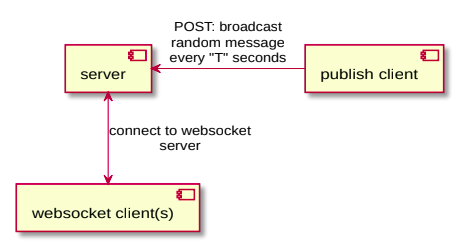

# Demo websocket

## Design architecture


## Run

1. Install vendor
    ```shell script
    go mod vendor
    ```

1. Server
    ```shell script
    cd ./srever && go run main.go
    ```

2. Publishing client
    ```shell script
    cd ./publishingclient && go run main.go
    ```

3. Websocket client
    ```shell script
    cd ./websocketclient && go run main.go
    ```
